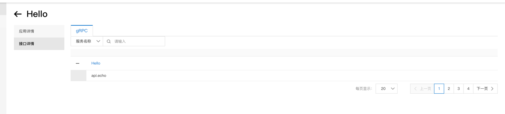

# opensergo (*This is a community driven project*)

## metainfo
Report meta info to opensergo

### How to use?

#### 1. Run opensergo-dashboard

refer to [opensergo-dashboard](https://github.com/opensergo/opensergo-dashboard) and run opensergo-dashboard

#### 2. Set environment variables

refer to [opensergo-specification](https://github.com/opensergo/opensergo-specification/tree/main/specification/en#data-plane-and-control-plane-communication-configuration) and set environment variables

```shell
export OPENSERGO_BOOTSTRAP_CONFIG={"endpoint":"127.0.0.1:9090"}
```

#### 3. Run example code

##### example code
```go
package main

import (
	...
	"github.com/cloudwego/kitex/server"
	"github.com/kitex-contrib/opensergo/metainfo"
	...
)

func main() {
	...
	r, err := metainfo.NewDefaultMetaReporter()
	if err != nil {
		panic(err)
	}
	svr := hello.NewServer(
		new(HelloImpl),
	)
	server.RegisterStartHook(func() {
		if err = r.ReportMetaInfo(svr.GetServiceInfo()); err != nil {
			klog.Error(err)
		}
	})
	...
}

```

##### command
```shell
go run example/server/main.go
```

### Screenshot




### More info
See [example](example/server/main.go)