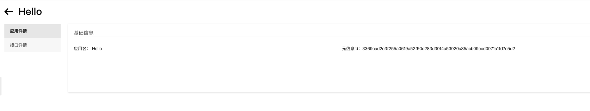

# opensergo (*This is a community driven project*)

## metainfo
Report meta info to opensergo

### How to use?

- run [opensergo-dashboard](https://github.com/opensergo/opensergo-dashboard)
- report meta info need register start hook function

```go
package main

import (
	...
	"github.com/cloudwego/kitex/server"
	"github.com/kitex-contrib/opensergo/metainfo"
	...
)

func main() {
	...
	r, err := metainfo.NewDefaultMetaReporter()
	if err != nil {
		panic(err)
	}
	svr := hello.NewServer(
		new(HelloImpl),
	)
	server.RegisterStartHook(func() {
		if err = r.ReportMetaInfo(svr.GetServiceInfo()); err != nil {
			klog.Error(err)
		}
	})
	...
}

```

### Screenshot



### More info
See [example](example/server/server.go)